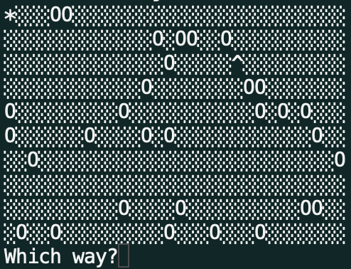

# Find Your Hat

Find Your Hat is an interactive terminal game. The objective is to move the character (star) across the field to find your hat (^) without falling into a hole (0) or going out of bounds. This game was made as a part of Codecademy's Front-End Engineer path. 

## How To Play 

In order to play the game you must have [Node](https://nodejs.org/en/download) installed on your local machine. After installing Node, download the Find Your Hat code and open the folder in your terminal. Install the dependencies. 

    npm install

Run the program with Node. 

    node index.js